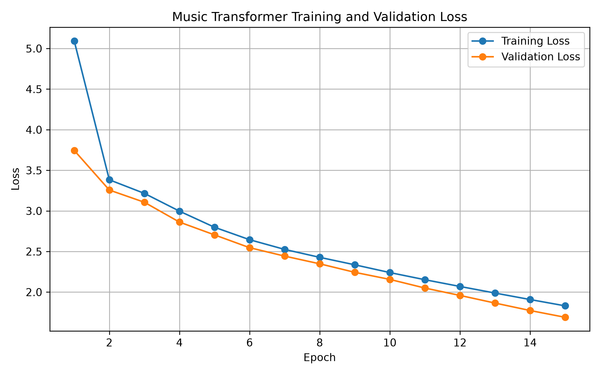
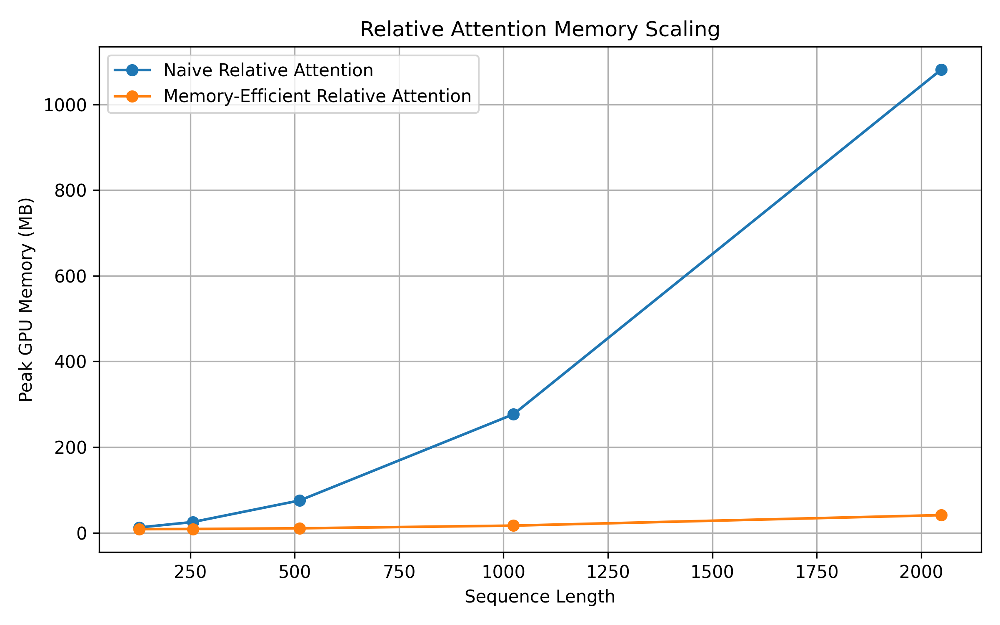
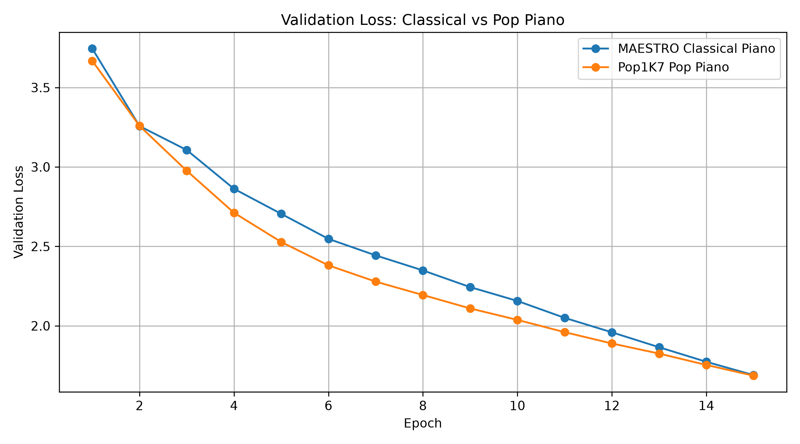

# Reproducing and Extending Music Transformer

**Tech Fellows Final Project — Mirla Tatiana Younes**

This project reproduces and extends **Music Transformer: Generating Music with Long-Term Structure** by Huang et al. (ICLR 2019).

The project focuses on:

1. Reproducing Music Transformer training and MIDI generation on a subset of the MAESTRO piano dataset.
2. Testing the memory advantage of the paper's memory-efficient relative positional attention.
3. Extending the experiment to a different musical distribution using Pop1K7 pop-piano MIDI data.

---

## Original Paper

**Music Transformer: Generating Music with Long-Term Structure**  
Huang et al., ICLR 2019

Paper:

https://arxiv.org/abs/1809.04281

Music Transformer extends the Transformer decoder using **relative positional attention** so that attention can represent the distance between musical events.

One important contribution of the paper is a memory-efficient method for computing relative attention without explicitly constructing a very large relative-position tensor of shape approximately:

```text
L × L × D
```

where:

- `L` = sequence length
- `D` = attention head dimension

---

## Baseline Implementation

This project builds on the open-source PyTorch implementation:

https://github.com/spectraldoy/music-transformer

Original implementation by **Aditya Gomatam / spectraldoy**.

The baseline repository provides:

- MIDI tokenization
- MIDI preprocessing
- Music Transformer architecture
- relative self-attention
- training
- autoregressive MIDI generation

My project adds reproduction experiments, memory analysis, dataset preparation, result plots, and documentation.

---

# Architecture

The model is a decoder-only Transformer using causal self-attention and learned relative positional representations.

Simplified pipeline:

```text
MIDI
  ↓
Event Tokenization
  ↓
Token IDs
  ↓
Embedding
  ↓
Transformer Decoder
  ↓
Relative Self-Attention
  ↓
Feed-Forward Network
  ↓
Vocabulary Logits
  ↓
Autoregressive Generation
  ↓
Generated MIDI
```

The relative-attention calculation can be represented conceptually as:

```text
Attention = softmax((QKᵀ + Srel) / √dk) V
```

where `Srel` contains the relative-position contribution.

The implementation uses a `skew()` operation to align compact relative-position scores with query-key positions.

---

# MIDI Representation

The model does not process raw audio.

MIDI performances are translated into symbolic events.

The vocabulary contains:

```text
128 note_on events
128 note_off events
125 time_shift events
32 velocity events
3 special tokens
```

Total vocabulary:

```text
416 tokens
```

Example:

```text
<start>
velocity_20
note_on_60
time_shift_15
note_off_60
...
<end>
```

---

# Dataset 1 — MAESTRO

The main reproduction experiment used a subset of the **MAESTRO piano performance dataset**.

Dataset:

https://magenta.tensorflow.org/datasets/maestro

I selected:

```text
100 MIDI files
```

After preprocessing:

```text
torch.Size([5000, 299])
```

This produced approximately:

```text
5000 sequences
~299 tokens per sequence
```

A reduced subset was used because of limited training time and compute.

---

# MAESTRO Model Configuration

The main model was trained using:

```text
Epochs:                  15
Batch size:              16
Model dimension:         128
Decoder layers:          3
Attention heads:         8
Feed-forward dimension:  512
Max relative distance:   256
Absolute positioning:    disabled
```

Because absolute positional encoding was disabled with:

```text
-map 0
```

the model used pure relative positional attention.

Example training command:

```bash
python train.py data/maestro_100.pt model100_ckpt.pt model100.pt 15 \
    -bs 16 \
    -d 128 \
    -nl 3 \
    -nh 8 \
    -dff 512 \
    -mrd 256 \
    -map 0
```

Training was performed using a GPU in Google Colab.

---

# MAESTRO Training Results

The MAESTRO model trained successfully for 15 epochs.

Training and validation loss decreased consistently during training.



The decreasing validation loss indicates that the model was learning the token distribution of the reduced MAESTRO dataset.

However, lower loss does not automatically imply strong musical structure in generated samples.

---

# Generated MAESTRO Music

The trained MAESTRO model was used to generate MIDI music.

Final generated sample:

```text
results/maestro100_generated.mid
```

Example generation command:

```bash
python generate.py models/model100.pt results/maestro100_generated.mid
```

The generated MIDI could be opened and listened to, but qualitative listening showed limited musical structure and melody.

This was expected given the relatively small dataset, reduced model size, short sequence length, and limited training compared with the original paper.

---

# Extension 1 — Memory-Efficient Relative Attention

The main technical extension of this project tests the paper's memory-efficiency claim.

I compared two approaches to relative positional attention.

## Naive Relative Position

The naive implementation explicitly constructs a relative-position tensor approximately shaped:

```text
[L, L, D]
```

This becomes extremely large as sequence length increases.

---

## Memory-Efficient Relative Position

The Music Transformer-style implementation computes relative scores in a more compact form and uses the `skew()` operation to align them.

This avoids explicitly constructing the large:

```text
L × L × D
```

relative-position tensor.

The standard attention score matrix:

```text
L × L
```

still exists.

Therefore, this experiment does **not** claim that all Transformer attention becomes linear in memory.

The improvement specifically concerns the additional memory required to represent relative positional information.

---

# Memory Experiment Results

Peak GPU memory was measured at several sequence lengths.

| Sequence Length | Naive Relative Position | Efficient Relative Position |
|---:|---:|---:|
| 128 | 12.38 MB | 8.31 MB |
| 256 | 25.00 MB | 8.75 MB |
| 512 | 75.38 MB | 10.38 MB |
| 1024 | 276.63 MB | 16.63 MB |
| 2048 | 1081.14 MB | 41.13 MB |

At sequence length:

```text
2048
```

the measurements were approximately:

```text
Naive:      1081 MB
Efficient:    41 MB
```

The naive implementation increased dramatically as sequence length grew, while the memory-efficient implementation required much less GPU memory for the relative-position computation.



Raw measurements:

```text
results/memory_comparison.csv
```

This experiment supports the practical motivation behind Music Transformer's memory-efficient relative-position calculation.

---

# Extension 2 — Pop Piano Genre Experiment

To test the architecture on a different musical distribution, I performed an additional experiment using **Pop1K7**, a pop-piano MIDI dataset.

The goal was to compare:

```text
MAESTRO classical piano
vs.
Pop1K7 pop piano
```

while keeping the model architecture and dataset size approximately equal.

---

# Pop1K7 Preparation

The downloaded Pop1K7 collection contained:

```text
5242 MIDI files
```

The MIDI files contained two tracks.

Inspection showed that:

```text
Track 0 → metadata / non-note information
Track 1 → piano note events
```

The piano track was automatically extracted into single-track MIDI files.

A subset of:

```text
100 MIDI files
```

was then selected.

After preprocessing:

```text
torch.Size([5000, 300])
```

This gave two closely matched datasets:

```text
MAESTRO: 5000 × 299
Pop1K7:  5000 × 300
```

---

# Pop1K7 Model Configuration

The Pop1K7 model used the same configuration as the MAESTRO model:

```text
Epochs:                  15
Batch size:              16
Model dimension:         128
Decoder layers:          3
Attention heads:         8
Feed-forward dimension:  512
Max relative distance:   256
Absolute positioning:    disabled
```

Using the same settings made the comparison more controlled.

---

# Classical vs Pop Validation Loss

The validation losses of the two models were compared.



The Pop1K7 model showed slightly lower validation loss during much of training.

By epoch 15, both models converged to approximately similar validation loss values.

This shows that the same Music Transformer configuration was capable of learning from both the MAESTRO classical-piano distribution and the Pop1K7 pop-piano distribution.

The lower Pop1K7 loss should not automatically be interpreted as better musical quality. Differences in repetition, predictability, and dataset structure can also affect cross-entropy loss.

---

# Generated Pop Piano Music

The Pop1K7 model was also used for autoregressive MIDI generation.

Final generated sample:

```text
results/pop100_generated.mid
```

Example generation command:

```bash
python generate.py models/pop100_model.pt results/pop100_generated.mid \
    -t 0.8 \
    -k 100
```

The generated MIDI could be opened and listened to.

Qualitatively, the output was still musically weak and lacked strong long-term structure.

This provides an important observation:

> Successful optimization and decreasing validation loss do not necessarily produce convincing musical compositions.

Changing the training genre alone did not solve the generation-quality limitations observed in this small-scale experiment.

---

# Main Experimental Scripts

My additional project scripts are stored in:

```text
experiments_mirla/
```

Important scripts include:

```text
plot_training_loss.py
memory_comparison.py
compare_genre_losses.py
extract_piano_track.py
make_pop100.py
```

These scripts were added for evaluation, visualization, and preparation of the Pop1K7 experiment.

---

# Important Result Files

```text
results/
├── genre_validation_loss_comparison.png
├── maestro100_generated.mid
├── memory_comparison.csv
├── memory_scaling_comparison.png
├── pop100_generated.mid
└── training_validation_loss.png
```

---

# Important Model Files

Models and checkpoints produced during the experiments include:

```text
models/model100.pt
models/model100_ckpt.pt
models/pop100_model.pt
models/pop100_ckpt.pt
```

Large model checkpoints may be kept outside GitHub because they are generated experiment artifacts.

---

# Project Structure

```text
music-transformer-reproduction/
│
├── data/
│   ├── maestro_100/
│   ├── Pop1K7/
│   ├── Pop1K7_piano_single/
│   └── pop100/
│
├── experiments_mirla/
│   ├── compare_genre_losses.py
│   ├── extract_piano_track.py
│   ├── make_pop100.py
│   ├── memory_comparison.py
│   └── plot_training_loss.py
│
├── models/
│   ├── model100.pt
│   ├── model100_ckpt.pt
│   ├── pop100_model.pt
│   └── pop100_ckpt.pt
│
├── results/
│   ├── genre_validation_loss_comparison.png
│   ├── maestro100_generated.mid
│   ├── memory_comparison.csv
│   ├── memory_scaling_comparison.png
│   ├── pop100_generated.mid
│   └── training_validation_loss.png
│
├── generate.py
├── layers.py
├── model.py
├── preprocessing.py
├── tokenizer.py
├── train.py
├── vocabulary.py
├── requirements.txt
└── README.md
```

Some large dataset and model files are intentionally kept locally instead of being committed to GitHub.

---

# Installation

Clone this reproduction repository:

```bash
git clone https://github.com/Miaw953/music-transformer-reproduction.git
cd music-transformer-reproduction
```

Install dependencies:

```bash
pip install -r requirements.txt
```

---

# MIDI Preprocessing

Example:

```bash
python preprocessing.py data/maestro_100 data/maestro_100.pt 256 -v
```

The preprocessing pipeline is approximately:

```text
MIDI
 ↓
Event vocabulary
 ↓
Token IDs
 ↓
Sequence sampling
 ↓
Data augmentation
 ↓
PyTorch tensor
```

---

# Training

Example MAESTRO training command:

```bash
python train.py data/maestro_100.pt model100_ckpt.pt model100.pt 15 \
    -bs 16 \
    -d 128 \
    -nl 3 \
    -nh 8 \
    -dff 512 \
    -mrd 256 \
    -map 0
```

Example Pop1K7 training command:

```bash
python train.py pop100.pt pop100_ckpt.pt pop100_model.pt 15 \
    -bs 16 \
    -d 128 \
    -nl 3 \
    -nh 8 \
    -dff 512 \
    -mrd 256 \
    -map 0
```

---

# Generation

MAESTRO:

```bash
python generate.py models/model100.pt results/maestro100_generated.mid
```

Pop1K7:

```bash
python generate.py models/pop100_model.pt results/pop100_generated.mid \
    -t 0.8 \
    -k 100
```

---

# Limitations

This is a small-scale reproduction rather than a reproduction of the full computational scale of the original Music Transformer research.

Important limitations include:

- only 100 MIDI files were used for each main dataset experiment;
- the model architecture was smaller than the large models used in the original research;
- training was limited to 15 epochs;
- sequences were much shorter than complete musical works;
- generation quality was evaluated informally by listening;
- validation loss does not directly measure musical coherence;
- the memory experiment isolates the relative-position component rather than claiming the entire Transformer has linear memory complexity;
- the genre experiment compares two relatively small subsets rather than full MAESTRO and Pop1K7 training corpora.

These limitations likely contributed to the weak musical quality of the generated samples.

---

# Main Findings

## 1. Music Transformer reproduction worked

The PyTorch Music Transformer successfully trained on the reduced MAESTRO dataset.

## 2. Loss decreased consistently

Training and validation losses decreased during the 15-epoch MAESTRO experiment.

## 3. Memory-efficient relative positioning used much less memory

At sequence length 2048:

```text
Naive relative representation:      ~1081 MB
Efficient relative representation:    ~41 MB
```

This demonstrates the practical memory advantage of avoiding the naive high-dimensional relative-position tensor.

## 4. The same architecture trained on pop piano

The same model configuration successfully trained on the Pop1K7 subset.

## 5. MAESTRO and Pop1K7 converged similarly

Pop1K7 produced slightly lower validation loss during much of training, but both models reached similar validation losses by epoch 15.

## 6. Low loss did not guarantee good music

Although both models optimized successfully, generated samples still lacked convincing long-term musical structure.

---

# Conclusion

This project reproduced the main Music Transformer training and generation pipeline using a PyTorch implementation.

The central experimental extension investigated memory-efficient relative positional attention.

The results showed a large difference between a naive relative-position representation and the memory-efficient Music Transformer-style calculation as sequence length increased.

An additional Pop1K7 experiment showed that the same relative-attention architecture could also learn from a non-classical pop-piano dataset.

However, generated music remained structurally weak despite decreasing validation loss.

The experiments therefore highlight both the usefulness of memory-efficient relative attention and the continuing difficulty of producing coherent long-term musical structure from limited data and training.

---

# References

## Music Transformer

Huang, C.-Z. A., et al.  
**Music Transformer: Generating Music with Long-Term Structure.**  
ICLR 2019.

https://arxiv.org/abs/1809.04281

## Original PyTorch Implementation

Aditya Gomatam / spectraldoy

https://github.com/spectraldoy/music-transformer

## MAESTRO Dataset

https://magenta.tensorflow.org/datasets/maestro

## Pop1K7

Pop1K7 pop-piano MIDI dataset used for the second-dataset experiment.

---

# License and Attribution

This repository builds upon the open-source `music-transformer` implementation by **Aditya Gomatam / spectraldoy**.

Original repository:

https://github.com/spectraldoy/music-transformer

The baseline project is licensed under the **GNU General Public License v3.0**.

The reproduction experiments, additional evaluation scripts, plots, dataset-preparation scripts, and documentation in this repository were created as part of this Tech Fellows final project.